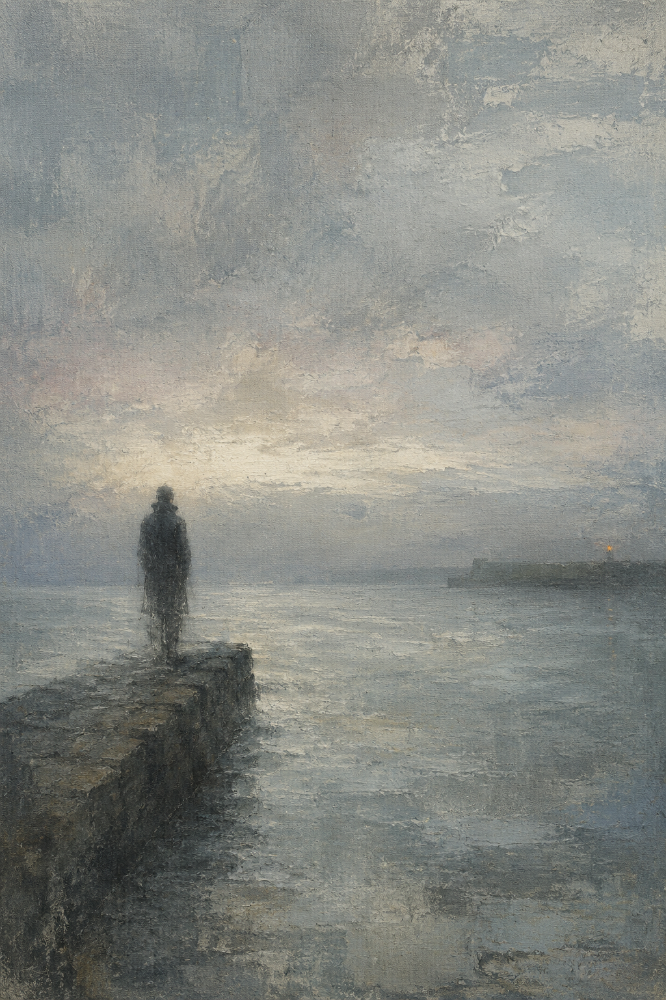
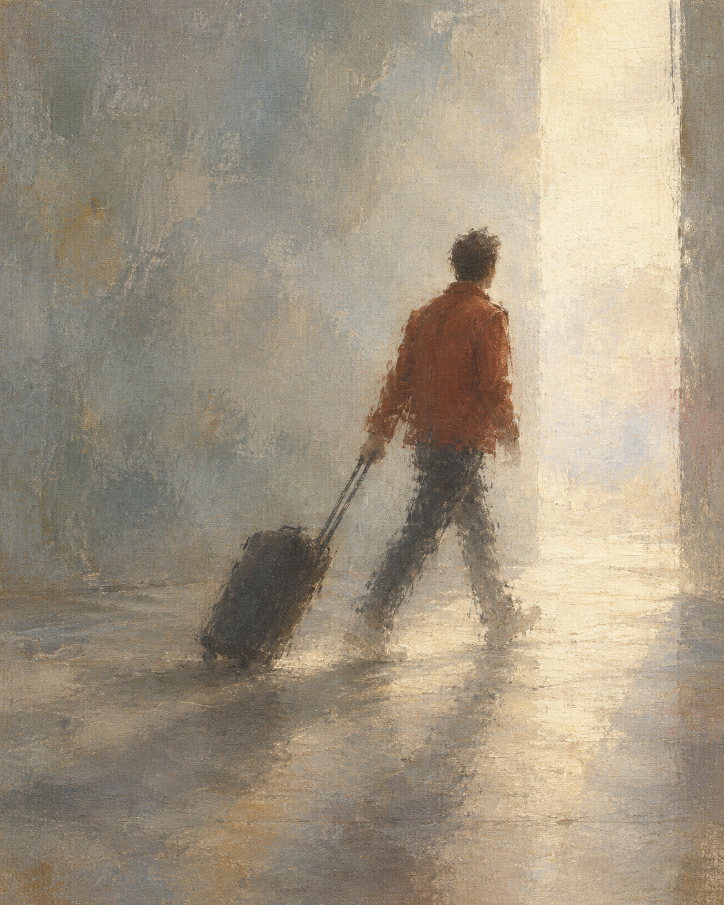
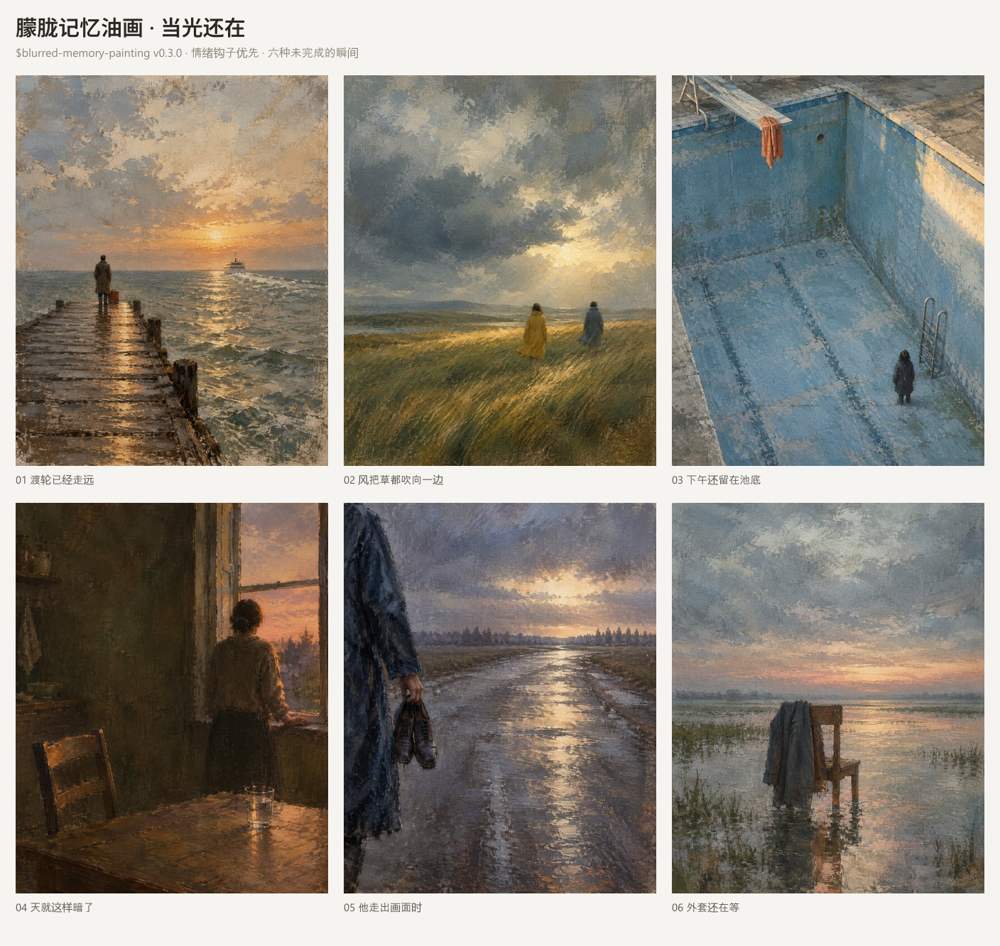

# 朦胧记忆油画 / Blurred Memory Painting

一个用于生成「面孔不可辨、边缘化进背景」的写意人物画的 Codex Skill。它不把照片虚化，而是把一张画的信息量压到只剩姿势、光、天气和距离——身份、年代、关系、结局全部抽走，让观众把画面认成自己的记忆。

> 完整说明书见 [MANUAL.md](MANUAL.md)：六种用法、从输入到输出的九步流程、改画的守住与改掉、故障排除对照表。

## 最简用法

```text
使用 $blurred-memory-painting 生成：场景 + 人物 + 光。
```

例如：

```text
使用 $blurred-memory-painting 生成：黄昏的海边，一个人背对着站在防波堤上，低角度落日在他背后。
```

未指定数量时，Skill 会内部构思三个场景并评分，只生成一张；也可以明确要求先给方案、指定张数、只要提示词，或做一组系列图集。

### 改画自己的照片

```text
使用 $blurred-memory-painting 把这张照片画成这种风格。
```

图生图时保留姿势、动作方向、人物间距与朝向、构图骨架与人物比例，以及服装色块和关键道具；面孔一律化掉，光线与背景重做，空间可以整体替换。正脸大头照会变成侧影或背影——这个风格不给面孔，认得出你的是姿势和距离。

## 特点

- 把模糊当成信息预算而不是滤镜：先决定扣留什么、交付什么，再动笔。
- 只画一到两人，绝不出现人群；面孔、年代、关系和结局一律不给。
- 地点是过道而不是目的地——海边、站台、栏杆、门口、有窗的暗室。
- 默认逆光，人物受光面通常很小；天空、水面或空场为记忆留出呼吸，但不牺牲有力量的近景、贴边或偶然裁切。
- 使用绘画语言而非摄影语言：布面油画、干笔拖扫、擦涂晕染、边缘化开、布纹可见、完成度不均匀。
- 暖色为时间感服务，不把落日、暖墙或一件外套的面积当成硬性配色错误。
- 支持把自己的照片改画成这种质感：保住姿势、距离与服装色块，删掉面孔、招牌、年代线索与人群。
- 参考图只用于提炼视觉语言，不复刻具体画面，也不打包第三方画作。
- 生成前内部筛选概念，避免为凑数堆低质量变体。

## 示例

### 文字生成：一次失败与一次修正



第一版的暖色与落日保留了强烈时间感；从 v0.3.0 起，skill 不会再为了配色规范把这种有生命力的偶然性重做掉。

### 照片改画：原照片 → 成品




姿势、行进方向、行李箱与铁锈红外套保留，脸化掉，机场换成一道光的门口。三张图与提示词原文都在 `examples/`。

### 系列展示：当光还在



六张图展示 v0.3.0 的“情绪钩子优先”：完整落日、大片晚光、雨后贴边离场、被留在池底的人、空椅与外套，都不是需要自动修掉的错误。短文与提示词见 `examples/series-02-when-the-light-stayed/`。

## 目录结构

```text
blurred-memory-painting/
├── SKILL.md                     核心机制、四个决策、视觉 DNA、反模式、输出模式
├── agents/openai.yaml           UI 元数据与调用策略
├── references/
│   ├── prompt-patterns.md       概念引擎、英文与中文提示词骨架、修正句式、系列模式
│   ├── visual-grammar.md       调色板、笔触库、人物处理、空场、室内、失败诊断
│   └── photo-edit.md            照片改画的保留／改写清单、编辑版骨架、按照片类型应对
├── scripts/
│   ├── generate_image.py        无内置图像工具时的文生图兜底（读 O10_API_KEY）
│   └── stylize_photo.py         无内置图像工具时的图生图兜底（读 O10_API_KEY）
├── examples/                    文生图、照片改画与六张系列展示，附提示词和短文
├── MANUAL.md                    使用说明书：六种用法、完整流程、守住与改掉、故障排除
├── README.md
├── VERSION
└── LICENSE
```

## 关于风格来源与版权

本 skill 的视觉语法整理自一类「失焦写意油画」的共同特征，最初由小红书笔记《画的越模糊，记忆越凶猛｜Anne Magill》引入。为避免生成他人作品的具体画面变体，本仓库：

- 不打包任何第三方画作或参考图；
- 在提示词中描述视觉属性（颜色、笔法、光位、留白、尺度），而不是要求模仿某位画家的具体作品；
- 要求每一次生成的人物、地点、动作与构图都是原创。

## 安装

把本目录放进 Codex skills 目录，使其结构如下：

```text
skills/
└── blurred-memory-painting/
    ├── SKILL.md
    ├── agents/
    ├── references/
    └── scripts/
```

随后在对话中用 `$blurred-memory-painting` 调用。图片生成依赖 Codex 内置的 `image_gen`。

## 当前版本

`v0.3.0`：支持原创文生图、照片改画、参考图视觉语言提炼、单张／导演／系列三种模式；以情绪钩子优先，只修硬伤，不用规范性抹掉有生命力的偶然性。
