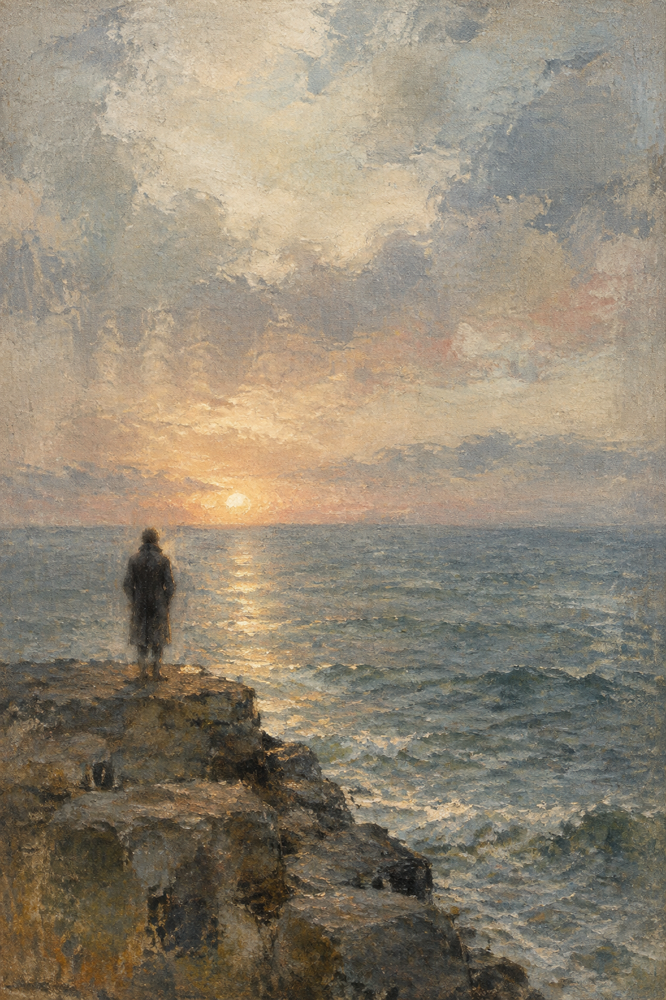

# 示例

01 与 02 是同一场景的两步实测：第一张暴露了本 skill 最典型的失败模式，第二张是按 [失败诊断](../references/visual-grammar.md) 做的一次定点修正。两张都是用 [提示词骨架](../references/prompt-patterns.md) 生成的原创画面，提示词原文保存在本目录的 `.txt` 文件中。

## 01 — 修正前

问题：暖色焦点失控。太阳被画成一个完整的金色圆盘，水面出现波光路径，整幅画滑向风景明信片；人物轮廓闭合、边缘偏硬，像剪贴上去的纸片；岩石与浪花的细节量也超过了"一段记忆"该有的信息量。

## 02 — 一次定点修正后

改动只落在失败的那一个维度：撤掉太阳与波光，换成雾中漫射平光；全画暖色缩成远处一个笔触大小的港口灯；水面与天空改成大面积平拖的笔触；让人物的肩线、衣摆与脚化进空气和石堤。

结果：面孔不可辨认，边缘化开，天气占了大半画面，读起来像"好像见过这个场面"，而不是某个人在海边的照片。

## 03 — 照片改画（输入一张原始照片）

输入是机场里拖着箱子行走的人。保留下来的：行走姿势、行进方向、拖在身后的行李箱、在画面中的位置与比例，以及铁锈红外套这一处暖色。被改掉的：面孔（化掉）、机场空间（替换成一道光的门口）、招牌、金属踢脚线、玻璃反光与天花。提示词原文见 `prompt-03-photo-to-painting.txt`。

原照片取自本机的 `frame-break-photo-art` 示例，仅用于演示。

## 系列二 — 当光还在

`series-02-when-the-light-stayed/` 是 v0.3.0 的六张展示套图。它刻意保留完整落日、大片暖光、贴边离场、遗留物和空间暧昧等“软偏离”，用来验证 skill 的新规则：情绪钩子优先，只修硬伤，不为满足格式把画面修平。

六张短文在 `series-02-when-the-light-stayed/CAPTIONS.md`；每张的英文生成提示词在同目录。
## 关于示例图的版权

示例图为本 skill 自行生成的原创画面，可自由使用。本仓库不收录任何第三方画作；参考他人作品时只提炼视觉语言，不复刻具体画面。
